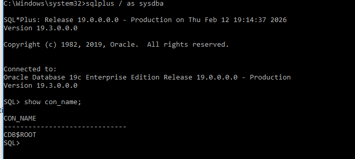
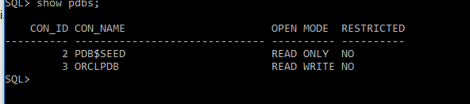
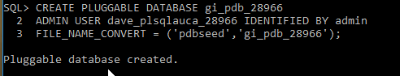
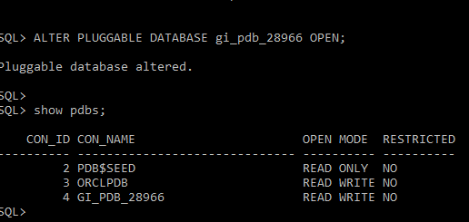
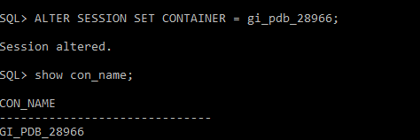
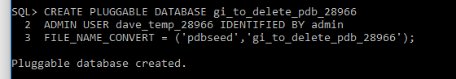
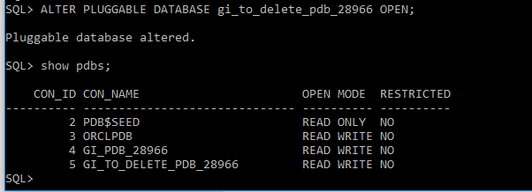
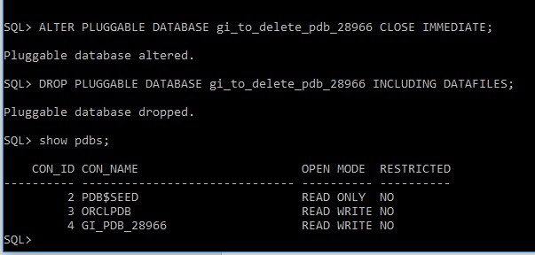

# PLUGGABLE DATABASE ASSIGNMENT

**Course:** Database Development with PL/SQL (INSY 8311)  
**Instructor:** Eric Maniraguha  
**Student:** Gisagara Dave Toussaint  
**Student ID:** 28966  
**Oracle used:** Oracle 19c

## Task 1: Create a New Pluggable Database

### Naming Convention Used

PDB Name: da_pdb_28966  
Username: dave_plsqlauca_28966  
Password: ********

---

### Evidence

#### 1. Connected to CDB$ROOT

#### 2. Verified Existing PDBs Before Creation

#### 3. Created New PDB Successfully

#### 4. Opened the New PDB

#### 5. Switched to the New PDB

#### 6. Created User Inside the PDB

---

## Task 2: Create and Delete a PDB

### Naming Convention Used

Temporary PDB Name: da_to_delete_pdb_28966

---

### Evidence Required

#### 1. Created Temporary PDB Successfully

#### 2. Verified That the Temporary PDB Exists

#### 3. Deleted the Temporary PDB Completely and confirming it no longer exists

---

## Task 3: Oracle Enterprise Manager (OEM)

### Requirements Verification

- OEM is accessible
- Dashboard reflects Oracle environment
- Completed PDB tasks visible
- Username visible on dashboard

---

### Evidence Required

#### OEM Dashboard Screenshot

## Issues Encountered and Solutions

### Issue 1: Unable to connect to PDB using SQL*Plus
**Problem:** Received ORA-12154 / ORA-01017 errors when trying to log in  
**Cause:** Incorrect service name or username/password  
**Solution:** Verified PDB name using `SHOW PDBS;` and reconnected using correct service

---
## Integrity Statement

I confirm that this assignment was completed independently and reflects my own work.  
All tasks, commands, configurations, and screenshots were performed and captured by me.  
I did not copy from other students, share my work, or use unauthorized assistance.

## Final Checklist (Apply Before Submission)

- [ok ] Repository name follows required format
- [ok ] Repository is PUBLIC
- [ok ] README.md is complete
- [ok ] Task 1 completed with screenshots
- [ok ] Task 2 completed with screenshots
- [ ok] Task 3 completed with OEM screenshot
- [ok ] Naming conventions followed exactly
- [ok ] All screenshots are clear and readable
- [ok ] Integrity statement included
- [ok ] GitHub link submitted through Google Form

